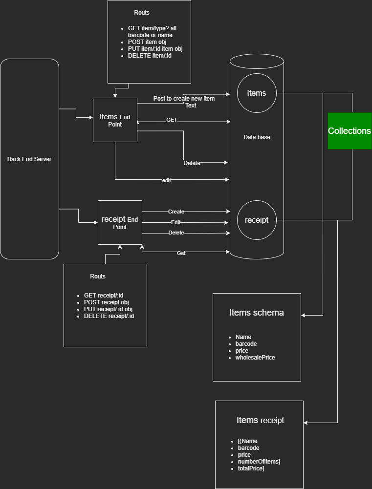

# This is an back end for small Janaa detergent sales shop data

## Janaa is detergent store owned by my dear friend he asked to make a application for his store to manage his sales

### customer story aka user story

#### summary of my friend's story

- able to add new products to the store
- able to save the record of the sales
- issue a recipe for the detergent
- able to see the sales report

## in the back end side of the application

1. over view of the application

- data base structure
  - need two collection for no sequel database data base i will use mongoDB
    - one for the products and the other for the sales
- express to mange the routs and end points for the application
  - two main routs
    - one for the products and the other for the sales
    - one for the sales report
  - its a CRUD application - create read update delete

## my structure for the application

